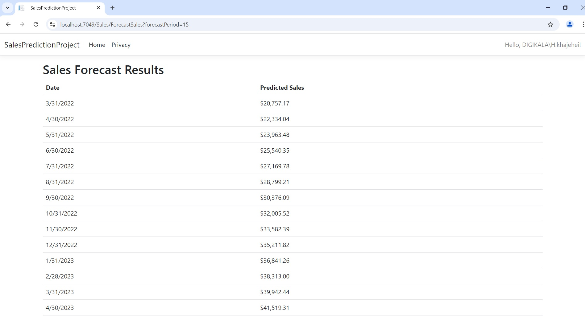

# Sales Prediction Project

This project is a **Sales Forecasting** application that uses historical sales data to predict future sales trends using **Python** (with `Prophet`), integrated into an **ASP.NET Core MVC** web application. It allows users to input historical sales data, forecast future sales, and display the results in a user-friendly web interface.

## Features
- Upload historical sales data
- Predict future sales based on historical data
- Display results in tabular format
- User-friendly interface with **ASP.NET MVC**
- Backend forecasting service using **Flask** and **Prophet**

## Technologies Used
- **ASP.NET Core MVC** for the web application framework
- **Flask API** to serve the forecasting model
- **Prophet** for time-series forecasting
- **Entity Framework Core** for database operations
- **SQL Server** as the database
- **HTML/CSS/JavaScript** for front-end

## Requirements
To run this project locally, you will need:
- **.NET SDK** (version 8.0 or later)
- **Python 3.12.3** with `Flask` and `Prophet`
- **SQL Server** or any database provider compatible with Entity Framework
- **Git**

## Installation and Setup

### 1. Clone the Repository
Clone this repository to your local machine:
```bash
git clone https://github.com/hkhajei/SalesPredictionProject.git
cd SalesPredictionProject
```
### 2. Set Up the Python Flask API
Navigate to the /python folder (or where your Python files are located), install the dependencies, and run the Flask server:

```bash
cd python
pip install -r requirements.txt
python app.py
```
### 3. Set Up the ASP.NET Core MVC Application
Go back to the root folder and run the ASP.NET Core project:

```bash
dotnet build
dotnet run
```
Ensure that the Flask API is running on http://127.0.0.1:5000.

### 4. Set Up the Database
Update the connection string in appsettings.json to point to your local SQL Server instance.
Run the following command to apply migrations and update the database:

```bash
dotnet ef database update
```
### 5. Run the Application
Go to your browser and navigate to http://localhost:5000 to see the web app.

## Usage
### Upload Sales Data
Go to the Upload page to upload historical sales data.
Ensure the data is in the correct format (e.g., CSV).

### Forecast Sales
After uploading the sales data, navigate to the Forecast page.
Enter the forecast period (e.g., number of months to predict).
The application will display the forecasted sales.

## Example Output

| Date       | Predicted Sales |
|------------|-----------------|
| 2022-06-01 | 12,345          |
| 2022-07-01 | 13,567          |
| 2022-08-01 | 14,789          |

## Project Structure
```mathematica
Copy code
├── Controllers/
│   ├── SalesController.cs
├── Models/
│   ├── Entity/
│   │   ├── SalesData.cs
│   │   ├── ForecastResult.cs
│   ├── Service/
│       ├── ForecastService.cs
├── Views/
│   ├── Home/
│   ├── Sales/
├── wwwroot/
├── python/
│   ├── forecast_model.py
│   ├── app.py
```
## Screenshots

